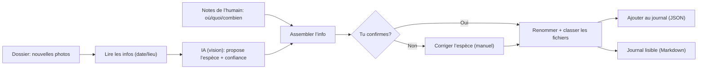
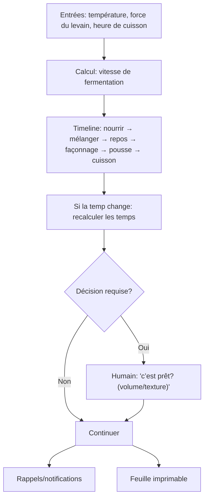
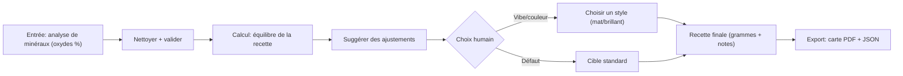
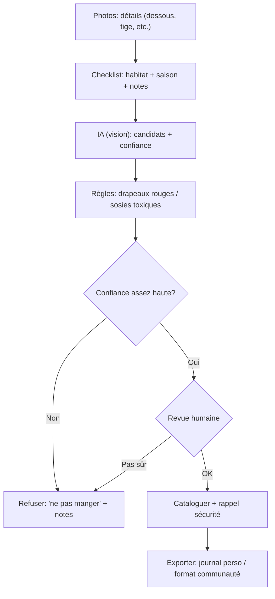
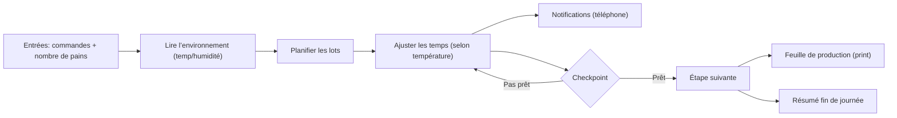
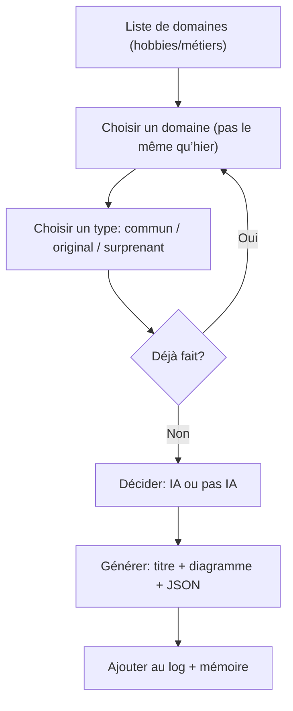
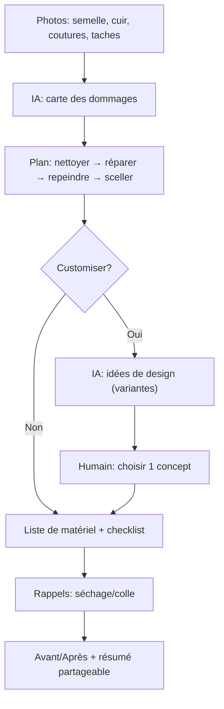
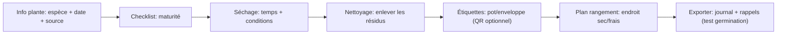
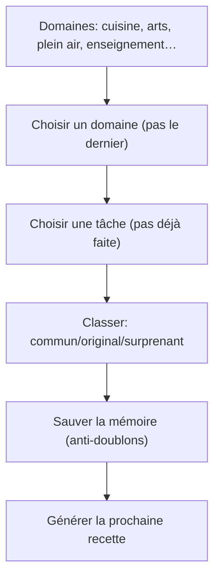
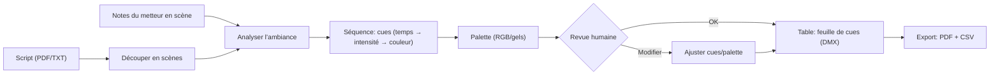

# Recettes du jour (exemples)

Cette page sert à montrer, **en images**, c’est quoi une *recette* (un workflow).

## Comment lire ça (sans être tech)

- Chaque **boîte** = une étape.
- Chaque **flèche** = “après ça, on fait ça”.
- Le but : tu vois que n’importe quel hobby/métier peut devenir une recette.

<Tip>
  Ces recettes viennent de `C:\Users\Administrator\Desktop\gemini-daily-flow.md`. On les utilise comme **exemples** pour inspirer la bibliothèque de workflows dans `vault-flows`.
</Tip>

---

## Jour 1 — Observation d’oiseaux + identification

---

## Jour 2 — Planificateur de levain (pain)

---

## Jour 3 — Recette de glaçure (céramique) à partir de cendre volcanique

---

## Jour 4 — “Cueillette sécuritaire” (plantes / champignons)

---

## Jour 5 — Micro‑boulangerie: horaire dynamique

---

## Jour 6 — Stratégie: générateur de recettes (anti‑répétition)

---

## Jour 7 — Restauration de sneakers vintage

---

## Jour 8 — Conservation de semences (botanique)

---

## Jour 9 — Scan quotidien (diversité de domaines)

---

## Jour 10 — Script‑to‑Lux (éclairage de théâtre)

---

## Pourquoi c’est important pour Vault Flows

Ces exemples montrent que “workflow” ne veut pas dire “programmation”.
C’est juste une façon de rendre une tâche **claire**, **répétable**, et **facile à partager**.

