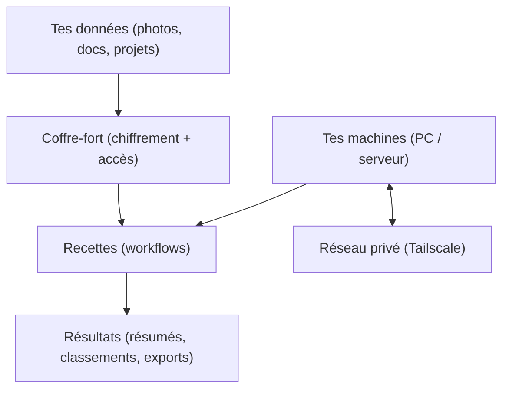

## Bienvenue chez VaultWares

### C’est quoi VaultWares, pour vrai?

VaultWares, c’est une façon de **protéger tes données** et de **faire rouler des tâches automatiquement**, tout en gardant le maximum de choses **chez toi** (ou sur des machines que TU contrôles).

Si tu veux une comparaison de “la vraie vie” :

- Tes données = **tes papiers importants** (photos, contrats, mots de passe, projets).
- VaultWares = **un coffre-fort + un assistant + une route privée**.

## Ce que nous offrons

<CardGroup cols={2}>
  <Card title="Outils (logiciel)" icon="diagram-project" href="/getting-started/products-and-services">
    Des apps et des écrans qui te laissent construire des “recettes” (workflows) et gérer tes données.
  </Card>
  <Card title="Réseau privé" icon="shield" href="/operations/tailscale">
    Un tunnel sécurisé entre tes machines. Pas besoin d’ouvrir ton serveur à tout Internet.
  </Card>
  <Card title="Opérations (pour l’équipe)" icon="network-wired" href="/operations/network-map">
    Pages “runbook” : où sont nos machines, comment on déploie, comment on garde ça stable.
  </Card>
  <Card title="Support" icon="headset" href="/support/faq">
    Les questions simples (et les réponses simples).
  </Card>
</CardGroup>

## Fonctionnalités clés

> Ici, “fonctionnalités” veut surtout dire : qu’est-ce que ça change dans ta vie.

| Besoin | En clair | Exemple |
|---|---|---|
| Vie privée | On évite d’envoyer tes données à des services publics | “Je peux résumer des documents sans les uploader sur un site.” |
| Contrôle | Tu sais où ça roule (PC / serveur) | “Mes jobs tournent sur mon ordi, pas sur un cloud random.” |
| Sécurité | Accès limité + réseau privé | “Mon serveur n’est pas ‘grand ouvert’ sur Internet.” |
| Simplicité | Des recettes réutilisables | “Je clique sur une recette au lieu de refaire 10 étapes.” |

## Pour commencer

<Steps>
  <Step title="Étape 1 — Choisis ton scénario">
    Choisis une phrase qui te ressemble :
    - “Je veux garder mes données privées.”
    - “Je veux automatiser des tâches répétitives.”
    - “Je veux une façon simple d’utiliser des modèles IA localement.”
  </Step>
  <Step title="Étape 2 — Commence avec une recette simple">
    Même si tu connais rien à la tech : commence par une recette “1 clic”.
    Tu vas comprendre le concept de workflow rapidement.
  </Step>
  <Step title="Étape 3 — Si tu as plusieurs machines, utilise le réseau privé">
    Si tu as un PC + un serveur : le réseau privé (Tailscale) rend ça simple et sécuritaire.
  </Step>
</Steps>

## Besoin d'aide?

<CardGroup cols={2}>
  <Card title="Contacter le support" icon="envelope" href="/support/contact">
    Obtenez de l'aide de notre équipe de soutien technique
  </Card>
  <Card title="Consulter les FAQ" icon="circle-question" href="/support/faq">
    Trouvez des réponses aux questions courantes
  </Card>
</CardGroup>

<Tip>
  Tu veux la version “grand public” en 60 secondes? Lis la page d’accueil : `/index-QC`.
</Tip>
