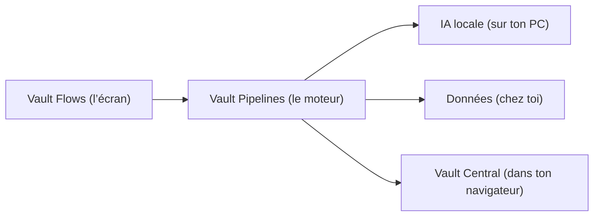

## Bienvenue dans l’écosystème VaultWares

### La promesse (en mots simples)

- **Tes données restent à toi.** On évite d’envoyer tes affaires personnelles dans des services publics.
- **Ça roule sur tes machines.** Ton PC, ton serveur, ton réseau privé.
- **On te donne des recettes.** Des workflows réutilisables, pour que tu ne recommences pas tout à zéro.

> Important : certaines choses ci-dessous peuvent être “en cours / à venir”. Si quelque chose est flou, on le marque comme tel.

## La “carte du resto” (quoi choisir?)

Voici une vue ultra simple :

## Produits logiciels (explication “grand-maman”)

| Produit | À quoi ça sert? | Où ça roule? | En une phrase |
|---|---|---|---|
| **Vault Flows** | Un écran simple pour lancer des recettes | Navigateur web | “Je clique, ça roule.” |
| **Vault Pipelines** | Le moteur derrière les recettes | PC/serveur | “Ça exécute les étapes.” |
| **Vault Central** | Un tableau de bord dans ton navigateur | Extension | “Tout voir au même endroit.” |
| **Identity Manager** | Gérer des identités/accès de façon sécurisée | Local | “Mon trousseau de clés, mais solide.” |

<Note>
  “Où ça roule?” = sur quelle machine ça s’exécute. Le but est de garder ça **le plus local possible**.
</Note>

## Matériel et appareils réseau

### On t’explique sans exagérer

Le matériel, c’est la partie “boîtes physiques” (routeurs, stockage, etc.). Si tu n’en as pas besoin, tu peux ignorer cette section.

<Tabs>
  <Tab title="Sécurité réseau">
    | Produit | Description | Fonctionnalités clés |
    |---------|-------------|--------------|
    | **Vault-Sentry** | Boîtier de détection d'intrusion (IDS) de niveau débutant. | Prise en charge à distance optionnelle, intégration AdGuard, filtrage DNS, gestion DHCP, déploiement Tailnet. |
    | **Vault-Sentinel** | Appareil avancé de détection d'intrusion et de gestion réseau. | Analyse de trafic de niveau entreprise, réponse automatisée aux menaces et tunneling sécurisé. |
    | **Routeurs portables** | Routeurs sécurisés prêts pour les voyages. | Équipés de cartes SIM anonymes, de listes Adblock curatées propriétaires et d'algorithmes anti-empreinte. |
  </Tab>
  <Tab title="Appareils sécurisés">
    | Produit | Description | Fonctionnalités clés |
    |---------|-------------|--------------|
    | **Ordinateurs portables/tablettes RISC-V** | Appareils informatiques à architecture ouverte. | Exécute QubesOS pour une compartimentalisation et une confidentialité maximales. |
    | **Téléphones sécurisés** | Appareils mobiles renforcés. | Préinstallés avec GrapheneOS, des interrupteurs de sécurité matériels et des suites de communication VaultWares. |
  </Tab>
</Tabs>

## Services et ajouts

On peut aussi offrir :

- de l’aide pour installer/configurer,
- des recettes/workflows sur mesure,
- des audits simples (“est-ce que ton setup est correct?”).

### Exemples concrets (plus parlant)

| Ce que tu demandes | Ce qu’on livre |
|---|---|
| “Je veux que mes données sortent jamais de mon PC.” | Une recette qui roule localement + une config réseau privée |
| “Je veux résumer mes docs chaque semaine.” | Un workflow planifié + un export lisible |
| “Je veux pas me faire suivre sur le web.” | Des réglages navigateur + listes anti-pistage + bonnes pratiques |

<Note>
  Tous les produits VaultWares adhèrent à notre politique stricte de zéro suivi. Nous ne collectons pas d'analyses, de télémétrie ou de journaux à distance. Vos données restent les vôtres.
</Note>
