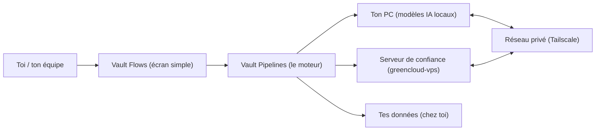

## Bienvenue chez VaultWares

### En une phrase

VaultWares t’aide à **garder tes données chez toi (ou sur tes machines de confiance)** et à **automatiser des tâches** sans que ça devienne un spaghetti de logiciels.

### 3 exemples qui parlent

| Si tu es… | Tu veux… | VaultWares t’aide à… |
|---|---|---|
| Un parent / une personne normale | garder des photos et documents privés | chiffrer et organiser sans “tout uploader” |
| Un créateur / une petite équipe | automatiser des tâches répétitives | créer des recettes réutilisables |
| Une PME | contrôler l’accès et les déploiements | utiliser un réseau privé + une méthode de déploiement contrôlée |

### L’image mentale (très simple)

Pense à VaultWares comme :

- un **coffre-fort** pour tes données,
- une **boîte d’outils** pour automatiser des tâches,
- une **route privée** (un petit “réseau secret”) pour que tes machines se parlent sans passer par l’Internet public.

### Ce qu’on fait (sans jargon)

| Ce que tu veux | Ce que VaultWares te donne | Exemple concret |
|---|---|---|
| Protéger tes fichiers | Chiffrement + rangement + accès contrôlé | “Mes docs restent lisibles seulement par moi.” |
| Automatiser sans te faire suivre | Des “recettes” (workflows) qui tournent sur tes machines | “Je résume des PDFs sans les uploader à une compagnie.” |
| Garder le contrôle | Un réseau privé + des déploiements contrôlés | “On n’expose pas nos trucs sensibles sur Internet.” |

<Note>
  Si un terme te semble flou (ex.: “workflow”, “tailnet”), c’est normal. Les pages “Démarrage” expliquent tout avec des exemples.
</Note>

<Tip>
  Si tu dois expliquer VaultWares en 10 secondes : “On garde tes données chez toi + on automatise des tâches, avec un réseau privé pour garder le contrôle.”
</Tip>

<Card
  title="Commencer (version très simple)"
  icon="rocket"
  href="/getting-started/overview"
  horizontal
>
  C’est la meilleure porte d’entrée si tu veux comprendre “qu’est-ce que VaultWares fait” sans être technique.
</Card>

## Explorer la documentation

<CardGroup cols={3}>
  <Card title="Démarrage" icon="circle-play" href="/getting-started/overview">
    Pour comprendre VaultWares en 10 minutes (avec des exemples et des images).
  </Card>
  <Card title="Produits et services" icon="sitemap" href="/getting-started/products-and-services">
    La liste de ce qu’on offre (et ce qui est “à venir”), expliqué en langage humain.
  </Card>
  <Card title="Opérations (privé)" icon="network-wired" href="/operations/network-map">
    Comment nos machines se parlent en privé (pour les personnes qui gèrent l’infra).
  </Card>
</CardGroup>

## Liens rapides

<CardGroup cols={2}>
  <Card title="C’est quoi un workflow?" icon="diagram-project" href="/getting-started/overview">
    Une “recette” : tu donnes des étapes, VaultWares exécute.
  </Card>
  <Card title="Réseau privé (Tailscale)" icon="shield" href="/operations/tailscale">
    Explication simple : pourquoi on utilise ça et comment ça protège.
  </Card>
  <Card title="Déploiement (simple)" icon="rocket" href="/operations/deployment-flow">
    Comment on met à jour les sites sans laisser GitHub faire des déploiements.
  </Card>
</CardGroup>

## Mini-glossaire (2 lignes chaque)

| Mot | Ça veut dire quoi? |
|---|---|
| **Workflow** | Une “recette” : une suite d’étapes qui fait une tâche à ta place. |
| **Local** | Ça tourne sur ton PC (pas sur un serveur public). |
| **Tailscale / tailnet** | Un réseau privé (comme un tunnel sécurisé) entre tes machines. |
| **VPS** | Un ordinateur “loué” sur Internet, mais que TU contrôles. |
| **Chiffrement** | Transformer des données en “charabia” illisible sans la clé. |
