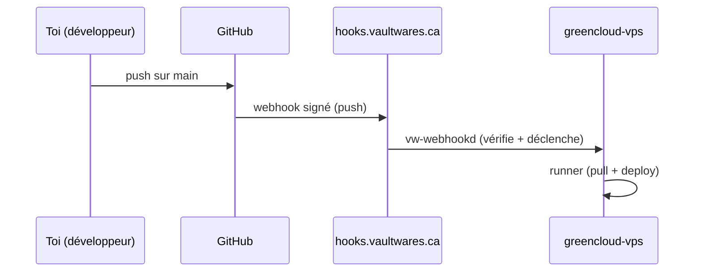

# Flux de déploiement (Privé)

Cette page est la **source de vérité** pour la façon dont on met à jour nos sites/apps.

## Résumé en 30 secondes (version “grand-maman”)

Quand on “pousse du code” (un changement), **GitHub ne fait PAS le déploiement**.

GitHub fait juste une chose : **envoyer un message signé** à notre serveur.

Ensuite, **notre serveur** (dans notre réseau privé) fait le déploiement.



## Principes (obligatoire)

- **Aucun déploiement via GitHub Actions.** Un `git push` sur `main` ne doit pas lancer de jobs build/deploy dans GitHub.
- **GitHub sert uniquement de source d’événements.** Le seul comportement côté GitHub lors d’un push sur `main` est une **livraison de webhook signée**.
- **Le déploiement s’exécute dans le tailnet** sur `greencloud-vps` (autorité de déploiement).

### Pourquoi on fait ça?

Parce qu’on veut :

- **Contrôle** : le déploiement est fait par *nos* machines.
- **Sécurité** : notre “vrai” système de déploiement est dans le réseau privé.
- **Cohérence** : même logique pour tous les sites, pas 12 façons différentes.

### Comparaison (plus concret)

| Sujet | GitHub Actions déploie | Notre modèle (webhook → runner privé) |
|---|---|---|
| Qui déploie? | Un ordinateur “à GitHub” | `greencloud-vps` (nous) |
| Où sont les secrets? | Dans GitHub | Dans VaultWarden sur le VPS |
| Contrôle réseau | Public | Privé (tailnet) |
| Risque de “surprise” | Moyen | Plus faible (on contrôle la machine) |

## Machines / endpoints

- **Autorité de déploiement :** `greencloud-vps` (IP publique `173.249.194.15`, Tailnet `100.73.93.84`)
- **Récepteur de webhooks GitHub (public, requis par GitHub) :** `https://hooks.vaultwares.ca/github`
  - nginx → `vw-webhookd` sur `127.0.0.1:9033`
- **Gestionnaire de webhooks Tailscale (tailnet-local) :** `vaultwares-hooks` sur `127.0.0.1:8787`

## Flux de bout en bout

```text
Développeur pousse vers GitHub (main)
  → GitHub livre un événement webhook signé (push)
  → https://hooks.vaultwares.ca/github (public)
  → reverse proxy nginx
  → vw-webhookd (127.0.0.1:9033) vérifie la signature + écrit le payload
  → vw-webhookd déclenche le runner de déploiement dans le tailnet
       (via vaultwares-hooks / déclencheur de job interne)
  → le runner pull le repo + déploie sur greencloud-vps
```

## “Message signé” : c’est quoi?

Un webhook, c’est comme un **reçu** (un message) que GitHub envoie automatiquement.
“Signé” veut dire : on peut vérifier que le message vient vraiment de GitHub (pas d’un inconnu).

## Exigences par repo

- Les repos **ne doivent pas** auto-déployer via `.github/workflows/*` sur `push` vers `main`.
- Les checks PR-only sont permis, mais tout **déploiement** doit être piloté par webhooks.
- Chaque repo doit configurer un webhook GitHub vers `https://hooks.vaultwares.ca/github`
  (voir `operations/project-bootstrap`).

## Secrets / vérification

- `VW_GITHUB_WEBHOOK_SECRET` vit dans VaultWarden (`https://warden.vaultwares.ca`, tailnet-only) et est provisionné sur `greencloud-vps`.
- Vérifiez la livraison + le traitement en confirmant :
  - `https://hooks.vaultwares.ca/health` retourne `200`
  - les logs de `vw-webhookd` sur `greencloud-vps` (et les logs du runner en aval)

