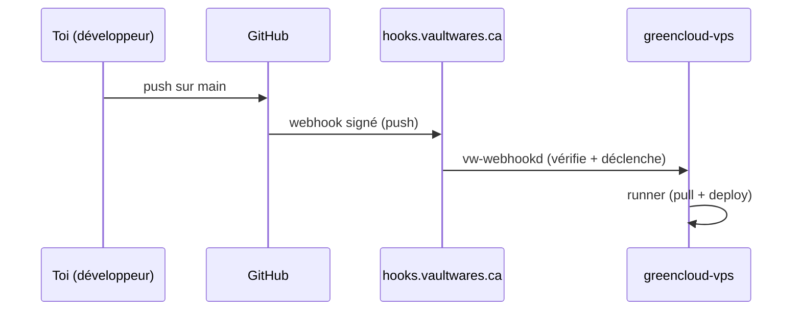

# Flux de déploiement (Privé)

Cette page est la **source de vérité** pour la façon dont on met à jour nos sites/apps.

Pages liées :
- `operations/services-inventory` (table unique de toutes les URLs/services)
- `operations/webhook-secret-rotation` (comment tourner `VW_GITHUB_WEBHOOK_SECRET` sans casser les deploys)

## Résumé en 30 secondes (version “grand-maman”)

Quand on “pousse du code” (un changement), **GitHub ne fait PAS le déploiement**.

GitHub fait juste une chose : **envoyer un message signé** à notre serveur.

Ensuite, **notre serveur** (dans notre réseau privé) fait le déploiement.


```mermaid
sequenceDiagram
  participant Dev as Toi (développeur)
  participant GH as GitHub
  participant Hooks as hooks.vaultwares.ca
  participant VPS as greencloud-vps
  Dev->>GH: push sur main
  GH->>Hooks: webhook signé (push)
  Hooks->>VPS: vw-webhookd (vérifie + déclenche)
  VPS->>VPS: runner (pull + deploy)
```

## Principes (obligatoire)

- **Aucun déploiement via GitHub Actions.** Un `git push` sur `main` ne doit pas lancer de jobs build/deploy dans GitHub.
- **GitHub sert uniquement de source d’événements.** Le seul comportement côté GitHub lors d’un push sur `main` est une **livraison de webhook signée**.
- **Le déploiement s’exécute dans le tailnet** sur `greencloud-vps` (autorité de déploiement).

### Pourquoi on fait ça?

Parce qu’on veut :

- **Contrôle** : le déploiement est fait par *nos* machines.
- **Sécurité** : notre “vrai” système de déploiement est dans le réseau privé.
- **Cohérence** : même logique pour tous les sites, pas 12 façons différentes.

### Comparaison (plus concret)

| Sujet | GitHub Actions déploie | Notre modèle (webhook → runner privé) |
|---|---|---|
| Qui déploie? | Un ordinateur “à GitHub” | `greencloud-vps` (nous) |
| Où sont les secrets? | Dans GitHub | Dans VaultWarden sur le VPS |
| Contrôle réseau | Public | Privé (tailnet) |
| Risque de “surprise” | Moyen | Plus faible (on contrôle la machine) |

## Machines / endpoints

- **Autorité de déploiement :** `greencloud-vps` (IP publique `173.249.194.15`, Tailnet `100.73.93.84`)
- **Récepteur de webhooks GitHub (public, requis par GitHub) :** `https://hooks.vaultwares.ca/github`
  - nginx → `vw-webhookd` sur `127.0.0.1:9033`
- **Gestionnaire de webhooks Tailscale (tailnet-local) :** `vaultwares-hooks` sur `127.0.0.1:8787`

## Flux de bout en bout

```text
Développeur pousse vers GitHub (main)
  → GitHub livre un événement webhook signé (push)
  → https://hooks.vaultwares.ca/github (public)
  → reverse proxy nginx
  → vw-webhookd (127.0.0.1:9033) vérifie la signature + écrit le payload
  → vw-webhookd déclenche le runner de déploiement dans le tailnet
       (via vaultwares-hooks / déclencheur de job interne)
  → le runner pull le repo + déploie sur greencloud-vps
```

## “Message signé” : c’est quoi?

Un webhook, c’est comme un **reçu** (un message) que GitHub envoie automatiquement.
“Signé” veut dire : on peut vérifier que le message vient vraiment de GitHub (pas d’un inconnu).

## Exigences par repo

- Les repos **ne doivent pas** auto-déployer via `.github/workflows/*` sur `push` vers `main`.
- Les checks PR-only sont permis, mais tout **déploiement** doit être piloté par webhooks.
- Chaque repo doit configurer un webhook GitHub vers `https://hooks.vaultwares.ca/github`
  (voir `operations/project-bootstrap`).

## Secrets / vérification

- `VW_GITHUB_WEBHOOK_SECRET` vit dans VaultWarden (`https://warden.vaultwares.ca`, tailnet-only) et est provisionné sur `greencloud-vps`.
- Si tu tournes ce secret, tu dois mettre à jour **les deux** : `vw-webhookd` + chaque webhook de repo. Voir `operations/webhook-secret-rotation`.
- Vérifiez la livraison + le traitement en confirmant :
  - `https://hooks.vaultwares.ca/health` retourne `200`
  - les logs de `vw-webhookd` sur `greencloud-vps` (et les logs du runner en aval)


## Propriété des chemins de déploiement

`vw-webhookd` tourne en **`vwdeploy`**. Tout chemin touché par un script de
déploiement sur `greencloud-vps` doit donc lui appartenir — à une exception près,
voulue : les répertoires d'exécution appartenant au compte de service qui les
consomme (`/opt/vault-warden` est à `vwsecrets`, `/opt/health-ledger/data` est à
`healthledger`).

**Pourquoi c'est plus grave que ça en a l'air.** Quand une copie de travail git
finit par appartenir à `root`, git la refuse (`detected dubious ownership`), le
script meurt sur `set -e`, et si le script dépêche vers d'autres hôtes *après* ce
point, ces hôtes ne sont jamais mis à jour non plus. Rien n'alerte. Le 27 août
2026, une inspection a trouvé trois dépôts exactement dans cet état :

| Chemin | Périmé depuis | Conséquence |
| --- | --- | --- |
| `/opt/health-ledger` | 2 semaines | config des sondes figée ; OVH jamais atteint |
| `/opt/vault-warden-src` | 3 semaines | service de secrets jamais redéployé |
| `/var/www/vaultwares-pwa-src` | 3 semaines | PWA jamais redéployée |

Les trois ont été corrigés le jour même. 22 des 26 chemins inspectés étaient déjà bons.

### Le vérificateur

```bash
ssh root@100.73.93.84 'python3 /var/www/deploy-scripts/verifier-permissions-deploiement.py'
```

Il lit `/etc/vw-webhookd/config.yml`, parcourt le script de chaque cible, ramasse
tout chemin sous `/var/www`, `/opt` et `/srv` que le script mentionne, et rapporte
le propriétaire de chacun. Il est en **lecture seule** sauf avec `--appliquer`, et
il préserve alors les sous-répertoires appartenant à un compte de service.

À lancer après l'ajout d'une cible, et chaque fois qu'un déploiement « réussit »
sans que rien ne change.

### Deux scripts supposent encore root

`deploy-vault-warden.sh` et `deploy-vaultwares-pwa.sh` appellent `chown` et
`systemctl` **sans `sudo`**, et écrivent dans des répertoires appartenant à root.
Ils ont été écrits pour un lanceur root ; les douze autres cibles supposent
`vwdeploy`. Leurs copies de travail git sont corrigées, donc ils ne meurent plus
à la première étape — mais les faire converger demande soit de préfixer les lignes
privilégiées par `sudo`, soit de confier ces deux répertoires à `vwdeploy`. Ça
touche un service de secrets, donc laissé à une session qui peut regarder
`vw-secretsd` redémarrer.

### Sur le sudo de `vwdeploy`

`vwdeploy` détient `(ALL : ALL) NOPASSWD: ALL`. Bon à savoir pour raisonner sur le
rayon d'action : le webhook est déclenché à distance, et ces scripts lancent
`npm ci`, qui exécute les scripts de cycle de vie des paquets. Lancer les scripts
*en tant que* root donnerait à ces scripts-là l'autorité de root — c'est
l'argument pour garder le lanceur non privilégié et corriger la propriété.
