# VaultWares Network Topology - Full Audit (Printable)

> **Generated:** Tue, 21 Jul 2026 12:35 America/Toronto
> **Tailnet:** tail1764b8.ts.net
> **Print:** Open in any Markdown viewer that supports Mermaid (GitHub, VS Code, Typora), then Ctrl+P.

---

## Network Topology Diagram

```mermaid
flowchart TB
  %% Internet
  subgraph Internet["Internet (Public)"]
    direction LR
    VW["vaultwares.ca"]
    Flows["flows.vaultwares.ca"]
    Noddit["noddit.org"]
    PK["prom-king.xyz"]
    FXV["fullxxx.video"]
    OnePorn["1pornhub.vip"]
    SexyPrn["sexyprn.lol"]
    LinksFXV["links.fullxxx.video"]
    LinksPK["links.prom-king.xyz"]
    TechOracle["theitguyde.com"]
    Hooks["hooks.vaultwares.ca"]
  end

  %% Tailnet boundary
  subgraph Tailnet["Tailnet (WireGuard)"]
    direction TB

    %% Tailnet-only services
    subgraph TNServices["Tailnet-only Services"]
      direction LR
      Docs["docs.vaultwares.ca"]
      Monitor["monitor.vaultwares.ca"]
      Stats["stats.vaultwares.ca"]
      Warden["warden.vaultwares.ca"]
      API["api.vaultwares.ca"]
      MCP["mcp.vaultwares.ca"]
      Comet["comet.vaultwares.ca"]
      Uptime["uptime.vaultwares.ca"]
      Decypharr["decypharr.vaultwares.ca"]
    end

    %% GreenCloud VPS
    subgraph GC["greencloud-vps<br/>Debian 12 | 100.73.93.84 | Public 173.249.194.15"]
      direction TB
      GCnginx["nginx :80/:443"]
      GCwebhook["vw-webhookd :9033"]
      GCsecrets["vw-secretsd :9444"]
      GChooks["vaultwares-hooks :8787"]
      GCtech["tech-oracle-api :9080"]
      GCpk["prom-king.xyz :4322"]
      GCfxv["fullxxx.video :4321"]
      GClinks["link-sharing :3001"]
      GChl["Health Ledger :8790/:8791"]
      GCpg["PostgreSQL :5432"]
      GCmaria["MariaDB :3306"]
      GCdock["Docker: secrets-pg :5444<br/>gluetun-proton :8890<br/>qa_runner<br/>qa_wireproxy :1085"]
      GCdns["dnsmasq :53 (Split-DNS)"]
      GCdisabled["vw-deployd (disabled)<br/>vw-deny-watch.timer (disabled)<br/>vw-token-expiry-watch.timer (disabled)"]
    end

    %% OVH VPS
    subgraph OVH["vps-ovhcloud<br/>Ubuntu | 100.67.25.118 | Public 51.79.55.113"]
      direction TB
      OVHnginx["nginx :80/:443"]
      OVHapi["VaultWares API :9001 (loopback)"]
      OVHmcp["MCP HTTP :9020 / SSE :9021"]
      OVHoneporn["oneporn.service"]
      OVHsexyprn["sexyprn.service"]
      OVHcomet["Comet (Docker) :5173 via VPN"]
      OVHmedia["Media Stack (Docker):<br/>qbittorrent :8081 | jackett :9117<br/>sonarr :8989 | radarr :7878<br/>lidarr :8686 | prowlarr :9696<br/>whisparr :6969 | sabnzbd :8082<br/>pyload-ng :8003 | flaresolverr :8191<br/>webdav :8083 | decypharr :8282"]
      OVHvpn["VPN Gateways (Docker):<br/>mullvad-gateway | gluetun-proton :8890<br/>comet-vpn | gluetun-comet-idx :9698"]
      OVHother["uptime-kuma :3001 (Docker)<br/>Health Ledger probe+heartbeat :8791<br/>upload-torrent-daemon"]
      OVHtimers["Timers: tube-uploader ~15m | drive-upload ~15m<br/>sab-rclone-mover ~1h | linkvertise ~50-70m | backup daily"]
    end

    %% Clopeux-Desktop
    subgraph PC["Clopeux-Desktop<br/>Windows | 100.71.101.21"]
      direction TB
      PCts["Tailscale Serve :443 -> Stash :9999"]
      PCstash["stash-win :9999"]
      PCzipper["python-zipper :5171"]
      PCtor["Tor SOCKS :20000 / Control :9051"]
      PCflare["flaresolverr :8191"]
      PCjackett["Jackett :9117"]
      PCpyload["pyLoad (local) :8003"]
      PCfilezilla["FileZilla :14148"]
      PCqb["qBittorrent (desktop)"]
      PChl["Health Ledger heartbeat :8791"]
      PCrdp["RDP :3389"]
      PCsmb["SMB :445/:139"]
    end

    %% Brume2
    subgraph Brume2["Brume2 / brumeux<br/>OpenWrt GL-MT2500 | 100.114.136.28<br/>Residential WAN 74.57.201.206"]
      Tinyproxy["tinyproxy :8888<br/>HTTP/CONNECT proxy<br/>(tailnet-only, 100.64.0.0/10)"]
    end
  end

  %% Public routing
  VW --> GC
  Flows --> GC
  Noddit --> GC
  PK --> GC
  FXV --> GC
  LinksFXV --> GC
  LinksPK --> GC
  TechOracle --> GC
  Hooks --> GC
  OnePorn --> OVH
  SexyPrn --> OVH

  %% Tailnet service routing
  Docs --> GC
  Monitor --> GC
  Stats --> GC
  Warden --> GC
  API --> OVH
  MCP --> OVH
  Comet --> OVH
  Uptime --> OVH
  Decypharr --> OVH

  %% Cross-VPS
  GC <-->|"API proxy :9001"| OVH
  GC -->|"media proxy"| OVH

  %% Residential egress
  OVH -->|":8888 CONNECT"| Brume2
  GC -->|":8888 CONNECT"| Brume2
  Brume2 -->|"residential WAN"| Internet

  %% Tailnet mesh
  PC <-.->|"Tailscale"| GC
  PC <-.->|"Tailscale"| OVH
  PC <-.->|"Tailscale"| Brume2
```



### Legend

| Color/Style | Meaning |
|---|---|
| Solid box | Machine or service |
| Dashed line | Tailscale (WireGuard) mesh |
| Solid arrow | Traffic flow (HTTPS/proxy) |
| `:PORT` | Listening port |

---

## Machine Details

### greencloud-vps

| Property | Value |
|---|---|
| OS | Debian 12 |
| Tailnet IP | `100.73.93.84` |
| Public IP | `173.249.194.15` |
| SSH | `root@100.73.93.84` (key: `greencloud-vps`) |
| Role | Web/docs/monitor, webhooks, secrets, health-ledger hub, tech-oracle, fullxxx, prom-king, link-sharing |

#### Listening Ports

| Port | Bind | Process | Service |
|---|---|---|---|
| 22 | 0.0.0.0 | sshd | SSH (tailnet-only) |
| 53 | 0.0.0.0 | dnsmasq | Split-DNS for tailnet hostnames |
| 80/443 | 0.0.0.0 / 100.73.93.84 | nginx | HTTP/HTTPS public + tailnet vhosts |
| 3001 | 0.0.0.0 | node (vwdeploy) | Link-sharing Fastify server |
| 4321 | 127.0.0.1 | node | FullXXX shared-tube app |
| 4322 | 0.0.0.0 | node (vwdeploy) | Prom-King content-site |
| 5432 | 127.0.0.1 | postgres | Local PostgreSQL |
| 3306 | 127.0.0.1 | mariadbd | Local MariaDB |
| 5444 | 127.0.0.1 | Docker (vw-secrets-postgres) | Postgres 16 for vault-warden |
| 8787 | 127.0.0.1 | uvicorn (vaultwares-hooks) | Tailscale webhook handler |
| 8790 | 127.0.0.1 | node | Health Ledger dashboard |
| 8791 | 100.73.93.84 | node | Health Ledger heartbeat (GC) |
| 8889/8890 | 127.0.0.1 | Docker (gluetun-proton) | ProtonVPN gateway |
| 9033 | 127.0.0.1 | python3 (vw-webhookd) | GitHub webhook receiver |
| 9080 | 100.73.93.84 | uvicorn (tech-oracle-api) | Tech Oracle FastAPI |
| 9444 | 127.0.0.1 | python (vw-secretsd) | VaultWares secrets service |
| 1085 | 0.0.0.0 | Docker (qa_wireproxy) | WireProxy for QA automation |

#### systemd Services (Active)

| Unit | Description |
|---|---|
| vw-webhookd.service | GitHub Webhook Receiver (runs as vwdeploy) |
| vaultwares-hooks.service | Tailnet webhook handler (uvicorn) |
| vw-secretsd.service | VaultWares Secrets |
| health-ledger-probe.service | Probe Joker |
| health-ledger-heartbeat.service | Host Heartbeat |
| health-ledger-dashboard.service | Dashboard |
| health-ledger-alarm.service | Alarm Joker |
| health-ledger-token.service | Token Joker |
| tech-oracle-api.service | Tech Oracle FastAPI |

#### systemd Services (Disabled)

- vw-deployd.service
- vw-deny-watch.timer
- vw-token-expiry-watch.timer

#### Docker Containers

| Container | Image | Ports | Role |
|---|---|---|---|
| gluetun-proton | qmcgaw/gluetun:latest | 8890/8889 | ProtonVPN for QA |
| qa_runner | qa-automation_qa-runner | (internal) | QA automation runner |
| qa_wireproxy | qa-automation_wireproxy | 0.0.0.0:1085 | WireProxy for QA |
| vw-secrets-postgres | postgres:16 | 127.0.0.1:5444 | Postgres for vault-warden |

#### nginx Sites Enabled

api, docs, flows, fullxxx.video, hooks, ledger, link-sharing, mcp, monitor, noddit.org, prom-king.xyz, secrets, stats, theitguyde.com, vaultwares.ca, vw-media-acme, vw-media-tailnet, warden .vaultwares.ca

---

### vps-ovhcloud

| Property | Value |
|---|---|
| OS | Ubuntu |
| Tailnet IP | `100.67.25.118` |
| Public IP | `51.79.55.113` |
| SSH | `ubuntu@100.67.25.118` (key: `tube-site-vps`) |
| Role | VaultWares API, MCP, shared-tube, Comet, media stack, Decypharr, Uptime Kuma |

#### Listening Ports

| Port | Bind | Process | Service |
|---|---|---|---|
| 22 | 0.0.0.0 | sshd | SSH (tailnet-only) |
| 53 | 127.0.0.1 | dnsmasq | DNS forwarding |
| 80/443 | public + tailnet | nginx | HTTP/HTTPS |
| 3001 | 0.0.0.0 | Docker (uptime-kuma) | Uptime Kuma |
| 5173 | 100.67.25.118 | Docker (comet-vpn) | Comet (via ProtonVPN) |
| 6969 | 127.0.0.1 | Docker (whisparr) | Whisparr |
| 7878 | 127.0.0.1 | Docker (radarr) | Radarr |
| 8003 | 100.67.25.118 | Docker (pyload-ng) | pyLoad web UI |
| 8081 | 127.0.0.1 | Docker (mullvad-gateway) | qBittorrent (via Mullvad) |
| 8082 | 127.0.0.1 | Docker (sabnzbd) | SABnzbd |
| 8083 | 127.0.0.1 | Docker (webdav) | WebDAV |
| 8191 | 100.67.25.118 | Docker (flaresolverr) | FlareSolverr |
| 8282 | 127.0.0.1 | Docker (decypharr) | Decypharr |
| 8686 | 127.0.0.1 | Docker (lidarr) | Lidarr |
| 8791 | 100.67.25.118 | node | Health Ledger heartbeat |
| 8989 | 127.0.0.1 | Docker (sonarr) | Sonarr |
| 9001 | 127.0.0.1 | python (FastAPI) | VaultWares API (loopback) |
| 9020 | 100.67.25.118 | python | MCP HTTP server |
| 9021 | 100.67.25.118 | python | MCP SSE server |
| 9117 | 100.67.25.118 | Docker (mullvad-gateway) | Jackett (via Mullvad) |
| 9696 | 127.0.0.1 | Docker (prowlarr) | Prowlarr |
| 9698/9119 | 100.67.25.118 | Docker (gluetun-comet-idx) | Comet indexer VPN |
| 1085 | 0.0.0.0 | Docker (qa_wireproxy) | WireProxy for QA |
| 8889/8890 | 0.0.0.0 | Docker (gluetun-proton) | ProtonVPN gateway |

#### systemd Services (Active)

| Unit | Description |
|---|---|
| vaultwares-api.service | VaultWares API |
| vaultwares-mcp.service | MCP HTTP |
| vaultwares-mcp-sse.service | MCP SSE |
| oneporn.service | 1pornhub.vip shared-tube |
| sexyprn.service | sexyprn.lol shared-tube |
| health-ledger-probe.service | Probe Joker |
| health-ledger-heartbeat.service | Host Heartbeat |
| upload-torrent-daemon.service | Torrent upload daemon |
| mullvad-netns-restart-deps.service | Restart qbt/jackett after mullvad |

#### systemd Timers

| Timer | Interval | Description |
|---|---|---|
| vw-tube-uploader.timer | ~15 min | rclone move tube content to GDrive |
| vw-drive-upload.timer | ~15 min | Upload media to GDrive |
| vw-sab-rclone-mover.timer | ~1 h | rclone move SABnzbd completed |
| vw-linkvertise.timer | ~50-70 min | Linkvertise downloader |
| vw-backup.timer | Daily | VPS backup to GDrive |

#### Docker Containers (23)

| Container | Image | Role |
|---|---|---|
| comet | g0ldyy/comet | Debrid manager |
| comet-postgres | postgres:18-alpine | Comet DB |
| comet-vpn | qmcgaw/gluetun:latest | ProtonVPN for Comet |
| decypharr | cy01/blackhole:latest | Debrid blackhole |
| uptime-kuma | louislam/uptime-kuma:2 | Monitoring |
| gluetun-proton | qmcgaw/gluetun:latest | ProtonVPN gateway |
| linkvertise-mullvad-rotation | qmcgaw/gluetun:latest | Mullvad rotation |
| pyload-ng | lscr.io/linuxserver/pyload-ng | Download manager |
| qbittorrent | ghcr.io/hotio/qbittorrent | Torrent client |
| jackett | lscr.io/linuxserver/jackett | Indexer |
| sabnzbd | ghcr.io/hotio/sabnzbd | Usenet downloader |
| radarr | ghcr.io/hotio/radarr | Movie manager |
| sonarr | ghcr.io/hotio/sonarr | Series manager |
| whisparr | ghcr.io/hotio/whisparr | Media manager |
| lidarr | ghcr.io/hotio/lidarr | Music manager |
| prowlarr | ghcr.io/hotio/prowlarr | Indexer manager |
| webdav | bytemark/webdav | WebDAV |
| mullvad-gateway | (custom) | Mullvad VPN gateway |
| flaresolverr | ghcr.io/flaresolverr/flaresolverr | CF challenge solver |
| torbox-sab-bridge | python:3.12-alpine | Torbox bridge |
| qa_runner | qa-automation-qa-runner | QA runner |
| qa_wireproxy | qa-automation-wireproxy | WireProxy |
| gluetun-comet-idx | qmcgaw/gluetun:latest | Comet indexer VPN |

#### nginx Sites Enabled

1pornhub.vip, api.vaultwares.ca, decypharr.vaultwares.ca, mcp.vaultwares.ca, sabnzbd.vaultwares.ca, sexyprn.lol, uptime.vaultwares.ca, vw-media-tailnet

#### Docker Compose Files

`/opt/vw-comet/`, `/opt/vw-protonvpn/`, `/opt/vw-media-stack/` (+ mullvad overrides), `/opt/vw-torbox-sab-bridge/`, `/opt/qa-automation/`, `/opt/vw-linkvertise/docker/`, `/opt/vw-comet-indexers/`

---

### Clopeux-Desktop

| Property | Value |
|---|---|
| OS | Windows |
| Tailnet IP | `100.71.101.21` |
| Access | RDP over Tailnet (3389); Tailscale Serve on :9999 |
| Role | Workstation, local services (Stash, Tor, FlareSolverr, Jackett, pyLoad, python-zipper) |

#### Listening Ports

| Port | Bind | Process | Service |
|---|---|---|---|
| 3389 | 0.0.0.0 | Windows RDP | Remote Desktop |
| 80 | 0.0.0.0 | Windows (System) | HTTP (IIS) |
| 445/139 | 0.0.0.0 | Windows (System) | SMB file sharing |
| 443 | 100.71.101.21 | tailscaled | Tailscale Serve (HTTPS to Stash) |
| 9999 | 0.0.0.0 | stash-win.exe | Stash (Tailscale Serve proxy) |
| 5171 | 0.0.0.0 | python.exe | python-zipper dataset builder |
| 8003 | [::1] | python.exe | Local pyLoad |
| 8191 | 0.0.0.0 | flaresolverr.exe | Local FlareSolverr |
| 9117 | 0.0.0.0 | JackettConsole.exe | Local Jackett |
| 8791 | 100.71.101.21 | node.exe | Health Ledger heartbeat |
| 14148 | 0.0.0.0 | filezilla-server.exe | FileZilla Server |
| 20000 | 127.0.0.1 | tor.exe | Tor SOCKS proxy |
| 9051 | 127.0.0.1 | tor.exe | Tor control port |

#### Local Applications

| App | Path | Role |
|---|---|---|
| stash-win | C:\Users\Administrator\Desktop\Executables\stash-win.exe | Stash media manager |
| python-zipper | C:\Users\Administrator\Desktop\Github Repos\python-zipper | Dataset builder, Tor rotator, telegram bot |
| tor | ...\python-zipper\Portable-Tor-Proxy-Rotator | Tor proxy for IP rotation |
| flaresolverr | C:\Users\Administrator\Desktop\Executables\flaresolverr | CF challenge solver |
| Jackett | C:\ProgramData\Jackett\JackettConsole.exe | Local indexer |
| FileZilla Server | C:\Program Files\FileZilla Server\ | FTP/SFTP |
| qBittorrent | C:\Program Files\qBittorrent\ | Local torrent client |

#### Tailscale Serve

```
https://clopeux-desktop.tail1764b8.ts.net (tailnet only)
|-- / proxy http://127.0.0.1:9999
```

---

### Brume2 / brumeux

| Property | Value |
|---|---|
| OS | OpenWrt (GL-MT2500) |
| Tailnet IP | `100.114.136.28` |
| Public IP | Residential `74.57.201.206` |
| Access | Tailscale-SSH only (no OpenSSH key/password) |
| Role | Residential egress proxy (tinyproxy) |

#### Listening Ports

| Port | Bind | Service |
|---|---|---|
| 8888 | 100.114.136.28 | tinyproxy HTTP/CONNECT (allowlisted 100.64.0.0/10) |

---

## Services Inventory

### Public (Internet-facing)

| Service | URL | Where | Repo |
|---|---|---|---|
| Main website | https://vaultwares.ca | greencloud-vps | vaultwares-website |
| vault-flows | https://flows.vaultwares.ca | greencloud-vps | vault-flows |
| Noddit | https://noddit.org | greencloud-vps | vault-flows |
| Prom-King content | https://prom-king.xyz | greencloud-vps :4322 | Prom-King/content-site |
| FullXXX tube | https://fullxxx.video | greencloud-vps :4321 | Prom-King/shared-tube |
| 1PornHub tube | https://1pornhub.vip | vps-ovhcloud (oneporn.service) | Prom-King/shared-tube |
| SexyPRN tube | https://sexyprn.lol | vps-ovhcloud (sexyprn.service) | Prom-King/shared-tube |
| FullXXX links | https://links.fullxxx.video | greencloud-vps :3001 | Prom-King/link-sharing |
| Prom-King links | https://links.prom-king.xyz | greencloud-vps :3001 | Prom-King/link-sharing |
| Tech Oracle | https://theitguyde.com | greencloud-vps :9080 | Prom-King/tech-oracle |
| GitHub webhooks | https://hooks.vaultwares.ca/github | greencloud-vps :9033 | (ops) |

### Tailnet-only

| Service | URL / Endpoint | Where |
|---|---|---|
| Docs | https://docs.vaultwares.ca | greencloud-vps |
| Monitor | https://monitor.vaultwares.ca | greencloud-vps |
| Stats | https://stats.vaultwares.ca | greencloud-vps |
| Agent Ledger | https://monitor.vaultwares.ca/ledger | greencloud-vps |
| Health Ledger UI | https://monitor.vaultwares.ca/health-ledger | greencloud-vps |
| API | https://api.vaultwares.ca | vps-ovhcloud :9001 |
| MCP HTTP | http://100.67.25.118:9020/mcp | vps-ovhcloud |
| MCP SSE | http://100.67.25.118:9021/mcp | vps-ovhcloud |
| Secrets | https://warden.vaultwares.ca | greencloud-vps :9444 |
| Comet | https://comet.vaultwares.ca | vps-ovhcloud :5173 VPN |
| Uptime Kuma | https://uptime.vaultwares.ca | vps-ovhcloud :3001 |
| Decypharr | https://decypharr.vaultwares.ca | vps-ovhcloud :8282 |
| Tech Oracle API | 100.73.93.84:9080 | greencloud-vps |
| Stash | http://100.71.101.21:9999 | Clopeux (Tailscale Serve) |
| HL heartbeat GC | 100.73.93.84:8791 | greencloud-vps |
| HL heartbeat OVH | 100.67.25.118:8791 | vps-ovhcloud |
| HL heartbeat PC | 100.71.101.21:8791 | Clopeux-Desktop |

### Local/Loopback (Clopeux-Desktop)

| Service | Endpoint | Visibility |
|---|---|---|
| python-zipper builder | http://100.71.101.21:5171 | Tailnet/local |
| Tor SOCKS | socks5://127.0.0.1:20000 | Loopback |
| Tor control | 127.0.0.1:9051 | Loopback |
| pyLoad (local) | http://[::1]:8003 | Loopback |
| FlareSolverr | http://100.71.101.21:8191 | Tailnet/local |
| Jackett | http://100.71.101.21:9117 | Tailnet/local |
| FileZilla | 100.71.101.21:14148 | Tailnet/local |
| RDP | 100.71.101.21:3389 | Tailnet |
| SMB | 100.71.101.21:445/139 | Tailnet/local |

### Residential Egress (Brume2)

| Service | Endpoint | Role |
|---|---|---|
| tinyproxy | http://100.114.136.28:8888 | HTTP/CONNECT proxy on Brume2. Egresses home WAN (74.57.201.206). Allowlisted to 100.64.0.0/10. Used by shared-tube /api/stream/* on both VPSes. |

---

## Tailnet Nodes

| Node | Type | IP | OS | Tags | Notes |
|---|---|---|---|---|---|
| clopeux-desktop | workstation | 100.71.101.21 | Windows | personal | RDP, Stash, Tor, FlareSolverr, Jackett, pyLoad, python-zipper, HL heartbeat |
| greencloud-vps | server | 100.73.93.84 | Debian 12 | tag:server | nginx, webhooks, secrets, HL hub, tech-oracle, fullxxx, prom-king, link-sharing, dnsmasq |
| vps-ovhcloud | server | 100.67.25.118 | Ubuntu | tag:server | VaultWares API, MCP, shared-tube, Comet, media stack, Decypharr, Uptime Kuma |
| brumeux | appliance | 100.114.136.28 | OpenWrt | tag:server | tinyproxy residential egress |
| aperture | personal | 100.90.168.111 | Windows | personal | Operator personal device |
| clopeux-iphone | personal | 100.75.112.67 | iOS | personal | Operator phone |
| clopeux-laptop | personal | 100.91.249.45 | Windows | personal | Operator laptop |
| ipad-9th-gen-wifi | personal | 100.84.168.106 | iOS | personal | Operator iPad |

---

## Split DNS Hostnames

Managed by dnsmasq on greencloud-vps. Each resolves to `100.73.93.84` for tailnet clients.

```
docs.vaultwares.ca
monitor.vaultwares.ca
stats.vaultwares.ca
mcp.vaultwares.ca
hooks.vaultwares.ca
secrets.vaultwares.ca
warden.vaultwares.ca
ledger.vaultwares.ca
pyload.vaultwares.ca
jackett.vaultwares.ca
qbittorrent.vaultwares.ca
sonarr.vaultwares.ca
radarr.vaultwares.ca
lidarr.vaultwares.ca
prowlarr.vaultwares.ca
whisparr.vaultwares.ca
sabnzbd.vaultwares.ca
decypharr.vaultwares.ca
comet.vaultwares.ca
flaresolverr.vaultwares.ca
uptime.vaultwares.ca
vaultwares.ca
www.vaultwares.ca
flows.vaultwares.ca
```

> **Note:** `api.vaultwares.ca` resolves to `vps-ovhcloud` (100.67.25.118), not greencloud. Do not enable Tailscale Serve on OVH :443.

---

## SSH Access

```powershell
# OVH (user: ubuntu, key: tube-site-vps)
ssh -i "$env:USERPROFILE\.ssh\tube-site-vps" ubuntu@100.67.25.118

# GreenCloud (user: root, key: greencloud-vps)
ssh -i "$env:USERPROFILE\.ssh\greencloud-vps" root@100.73.93.84
```

> Do not use `root@100.67.25.118` for normal diagnostics on OVH; that account rejects the local operator key. Use `ubuntu@` instead.

---

## Tailscale ACL Rules (Summary)

| Rule | Source | Destination | Ports | Purpose |
|---|---|---|---|---|
| Owner to servers | owner | tag:server | 22, 80, 443 | SSH + web |
| DNS | tag:server | tag:server | 53 TCP+UDP | Split-DNS |
| RDP | owner | 100.71.101.21 | 3389 | Remote Desktop |
| API direct | owner | 100.67.25.118 | 9001 | VaultWares API |
| API proxy | tag:server | 100.67.25.118 | 9001 | GC proxies to OVH API |
| HL probe | tag:server | tag:server | 80, 443 | Cross-VPS health probes |
| SSH dispatch | tag:vps-greencloud | tag:vps-ovhcloud | 22 | Deploy dispatcher SSH |
| Egress proxy | tag:server | 100.114.136.28 | 8888 | Residential egress (tinyproxy) |

---

## Key Notes

- **prom-king.xyz** runs on `greencloud-vps` (:4322), NOT OVH. nginx proxies /api/promking/ and /auth/ to vps-ovhcloud:9001.
- **Link sharing** runs on greencloud-vps (:3001) serving both links.fullxxx.video and links.prom-king.xyz. Old links.1pornhub.vip and links.sexyprn.lol are retired.
- **FullXXX** is on greencloud-vps (:4321). **1PornHub** and **SexyPRN** are on vps-ovhcloud (systemd services).
- **Health Ledger** runs on all 3 machines: Probe Joker + Heartbeat on greencloud and OVH, Heartbeat-only on Clopeux.
- **Comet** on OVH manages debrid lookups via ProtonVPN, exposed on 100.67.25.118:5173 through comet-vpn Docker network.
- **python-zipper** on Clopeux includes Portable Tor Proxy Rotator and dataset builder, used for QA automation and content acquisition.
- **vw-deployd** on greencloud is disabled. Deploy dispatch goes through vw-webhookd.
- **Tailscale Serve** is only on Clopeux-Desktop (Stash :9999). Do NOT enable on vps-ovhcloud :443 (breaks api.vaultwares.ca).
- **Brume2** is Tailscale-SSH only (no OpenSSH key/password). GL.iNet firmware disables OpenSSH when Tailscale-SSH is on.
- **Mullvad VPN** for media stack is opt-in. Use `/opt/vw-media-stack/bin/mullvad-compose all-up`, not `docker compose up -d`.
- GitHub org is **Prom-King** (capital P, capital K, hyphen) for all Prom-King repos.

---

*End of document. Generated from live audit Jul 2026.*
