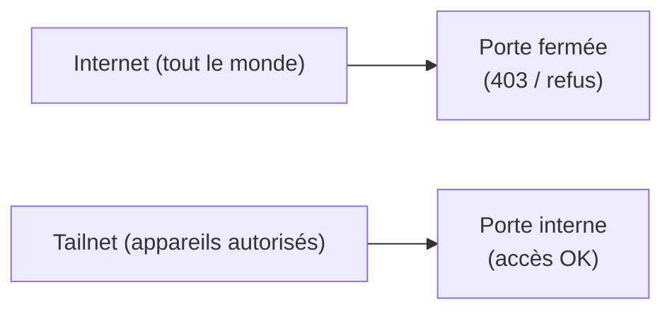

# Tailscale (Privé)

## Résumé en 30 secondes (pour non-tech)

Tailscale, c’est comme une **clé magnétique** pour entrer dans notre “corridor privé”.

- Sans la clé : tu vois seulement la porte publique (ou un refus).
- Avec la clé : tu peux accéder aux services internes **sans ouvrir l’accès au monde entier**.



## Objectifs de politique
- Tailnet est le **plan de contrôle par défaut**.
- Le SSH VPS est **uniquement sur le tailnet**.
- Les services sont explicitement autorisés par la politique (refus par défaut).

### Pourquoi c’est important?

Parce que ça réduit 2 risques fréquents :

| Risque | Exemple | Ce que Tailscale aide à éviter |
|---|---|---|
| Serveur “grand ouvert” | “N’importe qui peut scanner ton IP.” | On n’ouvre pas SSH/adm au public |
| Partage de secrets partout | “Les mots de passe sont copiés partout.” | Accès via réseau privé + listes blanches |

## Règles clés (actuelles)
- Le Propriétaire peut atteindre `tag:server` sur les ports `22`, `80`, `443`.
- Si nous utilisons un DNS divisé avec `greencloud-vps` comme serveur de noms, autoriser également `tag:server` sur le **DNS** (`53` TCP+UDP).
- Le Propriétaire peut atteindre `100.71.101.21` sur `3389` (RDP) et `100.67.25.118:9001` (API VaultWares).
- `tag:server` peut atteindre `100.67.25.118:9001` (reverse-proxy VPS vers l'hôte API OVH).

## Exposer les services web internes au tailnet (DNS divisé)

Certains sous-domaines (ex. `stats.vaultwares.ca`) sont des services **uniquement sur le tailnet**. L'enregistrement DNS public renvoie l'IP publique du VPS, qui sert un 403 à tous les clients non-tailnet. Les nœuds Tailnet résolvent le même nom d'hôte vers l'**IP Tailscale** de `greencloud-vps` via une substitution DNS Tailscale, contournant entièrement le vhost nginx public et atteignant un bloc de serveur nginx séparé et interne uniquement.

### Comment ça fonctionne

> L’analogie : même adresse sur l’enveloppe, mais **deux portes** selon si tu es “dans le corridor privé” ou non.

```
Public client  →  stats.vaultwares.ca  →  <public IP>  →  nginx (403, intentional)
Tailnet node   →  stats.vaultwares.ca  →  100.x.x.x    →  nginx (internal vhost, 200)
```

### Étape 1 — Substitution DNS Tailscale

Dans la [console d'administration Tailscale](https://login.tailscale.com/admin/dns) → **Nameservers** :

- Ajouter des entrées de **DNS divisé** exactes pour chaque nom privé qui doit passer par `greencloud-vps`.
- Pointer chaque entrée vers l'IP Tailscale de `greencloud-vps` (`100.73.93.84`).
- Garder les noms publics, comme `vaultwares.ca`, `www.vaultwares.ca` et `flows.vaultwares.ca`, hors de cette substitution exacte sauf si l'objectif est vraiment de forcer les clients tailnet vers l'adresse tailnet du VPS.

Noms privés actuels :

```text
docs.vaultwares.ca
monitor.vaultwares.ca
stats.vaultwares.ca
mcp.vaultwares.ca
hooks.vaultwares.ca
secrets.vaultwares.ca
warden.vaultwares.ca
ledger.vaultwares.ca
```

`api.vaultwares.ca` est volontairement exclu du groupe DNS divisé de Greencloud.
Il résout vers `vps-ovhcloud` (`100.67.25.118`) parce que OVH possède
l'exécution de l'API VaultWares et de Postgres local. Nginx sur OVH possède
`100.67.25.118:443`; ne pas activer Tailscale Serve sur HTTPS `443` sur OVH,
car il intercepte les clients tailnet avant nginx et casse `api.vaultwares.ca`.

> L'ACL doit autoriser `tag:server` sur le port **53** (TCP+UDP) si `greencloud-vps` est le serveur de noms faisant autorité. Voir Règles clés ci-dessus.

### Étape 2 — vhost interne nginx sur l'interface Tailscale

Ajouter un deuxième bloc `server` qui écoute uniquement sur l'IP Tailscale :

```nginx
server {
    listen 100.x.x.x:443 ssl;
    server_name stats.vaultwares.ca;

    # Tailscale-issued cert (or Let's Encrypt if using tailscale cert)
    ssl_certificate     /etc/nginx/certs/stats.vaultwares.ca.crt;
    ssl_certificate_key /etc/nginx/certs/stats.vaultwares.ca.key;

    root /var/www/stats.vaultwares.ca;
    index index.html;

    location / {
        try_files $uri $uri/ /index.html;
    }
}
```

Remplacer `100.x.x.x` par l'IP Tailscale réelle de `greencloud-vps`. Recharger nginx :

```bash
sudo nginx -t && sudo systemctl reload nginx
```

### Certificat TLS pour le vhost interne

Vous avez deux options :

- **`tailscale cert`** — génère un certificat Let's Encrypt valide pour le FQDN MagicDNS. Fonctionne si le `server_name` du vhost correspond au nom MagicDNS.
- **Certificat Let's Encrypt existant** — si vous avez déjà un certificat wildcard ou SAN pour `*.vaultwares.ca`, réutilisez-le ici.

### Note sur l'ACL

Aucun changement d'ACL n'est nécessaire pour le trafic web lui-même — la règle existante `owner → tag:server : [80, 443]` couvre déjà cela. L'entrée DNS divisé est le seul portier.

## Notes opérationnelles

- Éviter d'attribuer des étiquettes à des appareils personnels à moins que vous ne souhaitiez qu'ils se comportent comme des « comptes de service ».
- Préférer des étiquettes dédiées pour l'infrastructure : `tag:server`, `tag:vps-old`, `tag:vps-greencloud`.
- Brume2 gère le réseau domestique; mettre à jour Tailscale avec soin pour éviter de perturber le routage.
